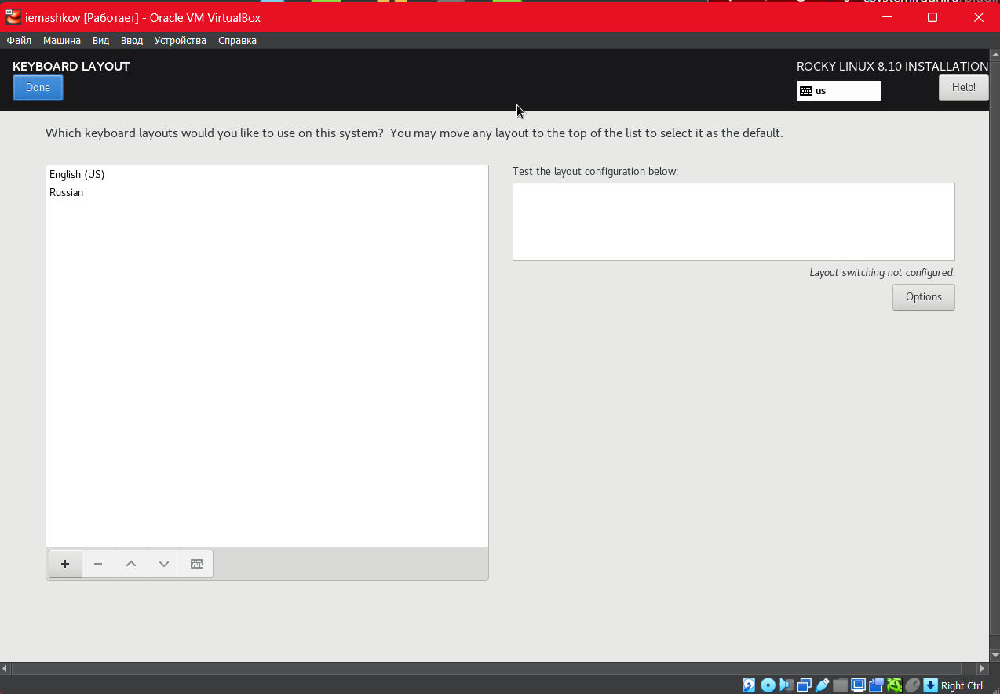
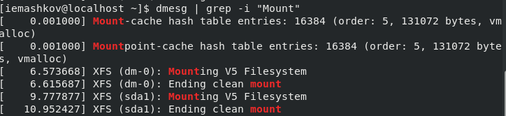

---
## Front matter
title: "Лабораторная работа №1"
subtitle: "Основы информационной безопасности"
author: "Машков Илья Евгеньевич"

## Generic otions
lang: ru-RU
toc-title: "Содержание"

## Bibliography
bibliography: bib/cite.bib
csl: pandoc/csl/gost-r-7-0-5-2008-numeric.csl

## Pdf output format
toc: true # Table of contents
toc-depth: 2
lof: true # List of figures
lot: true # List of tables
fontsize: 12pt
linestretch: 1.5
papersize: a4
documentclass: scrreprt
## I18n polyglossia
polyglossia-lang:
  name: russian
  options:
	- spelling=modern
	- babelshorthands=true
polyglossia-otherlangs:
  name: english
## I18n babel
babel-lang: russian
babel-otherlangs: english
## Fonts
mainfont: PT Serif
romanfont: PT Serif
sansfont: PT Sans
monofont: PT Mono
mainfontoptions: Ligatures=TeX
romanfontoptions: Ligatures=TeX
sansfontoptions: Ligatures=TeX,Scale=MatchLowercase
monofontoptions: Scale=MatchLowercase,Scale=0.9
## Biblatex
biblatex: true
biblio-style: "gost-numeric"
biblatexoptions:
  - parentracker=true
  - backend=biber
  - hyperref=auto
  - language=auto
  - autolang=other*
  - citestyle=gost-numeric
## Pandoc-crossref LaTeX customization
figureTitle: "Рис."
tableTitle: "Таблица"
listingTitle: "Листинг"
lofTitle: "Список иллюстраций"
lotTitle: "Список таблиц"
lolTitle: "Листинги"
## Misc options
indent: true
header-includes:
  - \usepackage{indentfirst}
  - \usepackage{float} # keep figures where there are in the text
  - \floatplacement{figure}{H} # keep figures where there are in the text
---

# Цель работы

Приобретение практических навыков установки операционной системы на виртуальную машину,настройки минимально необходимых для дальнейшей работы сервисов.

# Задание

1. Настройка виртуальной машины
2. Установка Linux Rocky
3. Установка драйверов
4. Домашнее задание

# Выполнение лабораторной работы

## Настройка виртуальной машины

Создаю новую виртуальную машину, указываю на папку для хранения её данных и образ системы, который собираюсь установить (рис. [-@fig:001]).

{#fig:001 width=70%}

Затем задаю количество ОЗУ и ядер процессора, которые будут использоваться (рис. [-@fig:002]).

{#fig:002 width=70%}

И наконец, создаю диск под машину размером в 50ГБ (рис. [-@fig:003]).

{#fig:003 width=70%}

## Работа с установщиком Rocky

В установщике настраиваю языки, которые и будут использоваться в системе (рис. [-@fig:004]).

{#fig:004 width=70%}

Выключаю параметр KDUMP (рис. [-@fig:005]).

{#fig:005 width=70%}

Включаю Ethernet (рис. [-@fig:006]).

{#fig:006 width=70%}

Задаю имя пользователя и пароль для него, а также делаю его администратором по умолчанию (рис. [-@fig:007]).

{#fig:007 width=70%}

Подключаю **средства для разаработки** к своей системе (рис. [-@fig:008]).

{#fig:008 width=70%}

## Работа с Rocky

Соглашаюсь с лицензионным соглашением (прошу прощения за тавтологию) (рис. [-@fig:009]).

{#fig:009 width=70%}

Устанавливаю дополнение для гостевой ОС (рис. [-@fig:010]) (рис. [-@fig:011]).

{#fig:010 width=70%}

{#fig:011 width=70%}

## Домашняя работа

1. Используя команду **"dmesg | less"** читаю информацию о своей системе (рис. [-@fig:012]).

{#fig:012 width=70%}

2. Затем благодаря параметру **"grep -i "название""**  и той же команды **dmesg** ищу различные вещи.

- Версия ядра Linux (Linux version) рис. [-@fig:013]).

{#fig:013 width=70%}

- Частота процессора (Detected MHz processor) рис. [-@fig:014]).

{#fig:014 width=70%}

- Модель процессора (CPU0) рис. [-@fig:015]).

{#fig:015 width=70%}

- Обьём ОЗУ (Memory available) рис. [-@fig:016]).

{#fig:016 width=70%}

- Тип гипервизора (Hypervisor detected) рис. [-@fig:017]).

{#fig:017 width=70%}

- Тип файловой системы корневого раздела рис. [-@fig:018]).

{#fig:018 width=70%}

- Последовательность монтирования файловых систем рис. [-@fig:019]).

{#fig:019 width=70%}
 
# Ответы на контрольные вопросы

1. Учетная запись содержит необходимые для идентификации пользователя при подключении к системе данные, а так же информацию для авторизации и учета: системного имени (user name) (оно может содержать только латинские буквы и знак нижнее подчеркивание, еще оно должно быть уникальным), идентификатор пользователя (UID) (уникальный идентификатор пользователя в системе, целое положительное число), идентификатор группы (CID) (группа, к к-рой относится пользователь. Она, как минимум, одна, по умолчанию - одна), полное имя (full name) (Могут быть ФИО), домашний каталог (home directory) (каталог, в к-рый попадает пользователь после входа в систему и в к-ром хранятся его данные), начальная оболочка (login shell) (командная оболочка, к-рая запускается при входе в систему).

2. Для получения справки по команде: <команда> —help; для перемещения по файловой системе - cd; для просмотра содержимого каталога - ls; для определения объёма каталога - du <имя каталога>; для создания / удаления каталогов - mkdir/rmdir; для создания / удаления файлов - touch/rm; для задания определённых прав на файл / каталог - chmod; для просмотра истории команд - history.

3. Файловая система - это порядок, определяющий способ организации и хранения и именования данных на различных носителях информации. Примеры: FAT32 представляет собой пространство, разделенное на три части: олна область для служебных структур, форма указателей в виде таблиц и зона для хранения самих файлов. ext3/ext4 - журналируемая файловая система, используемая в основном в ОС с ядром Linux.

4. С помощью команды df, введя ее в терминале. Это утилита, которая показывает список всех файловых систем по именам устройств, сообщает их размер и данные о памяти. Также посмотреть подмонтированные файловые системы можно с помощью утилиты mount.

5. Чтобы удалить зависший процесс, вначале мы должны узнать, какой у него id: используем команду ps. Далее в терминале вводим команду kill < id процесса >. Или можно использовать утилиту killall, что "убьет" все процессы, которые есть в данный момент, для этого не нужно знать id процесса. 

# Выводы

Я приобрел практические навыки установки операционной системы на виртуальную машину, настройки минимально необходимых для дальнейшей работы сервисов.

# Список литературы{.unnumbered}

[Основы информационной безопасности](https://esystem.rudn.ru/pluginfile.php/2580589/mod_folder/content/0/001-lab_virtualbox.pdf)
