---
## Front matter
title: "Отчёт по лабораторной работе №4"
subtitle: "Основы информационной безопасности"
author: "Машков Илья Евгеньевич"

## Generic otions
lang: ru-RU
toc-title: "Содержание"

## Bibliography
bibliography: bib/cite.bib
csl: pandoc/csl/gost-r-7-0-5-2008-numeric.csl

## Pdf output format
toc: true # Table of contents
toc-depth: 2
lof: true # List of figures
lot: true # List of tables
fontsize: 12pt
linestretch: 1.5
papersize: a4
documentclass: scrreprt
## I18n polyglossia
polyglossia-lang:
  name: russian
  options:
	- spelling=modern
	- babelshorthands=true
polyglossia-otherlangs:
  name: english
## I18n babel
babel-lang: russian
babel-otherlangs: english
## Fonts
mainfont: PT Serif
romanfont: PT Serif
sansfont: PT Sans
monofont: PT Mono
mainfontoptions: Ligatures=TeX
romanfontoptions: Ligatures=TeX
sansfontoptions: Ligatures=TeX,Scale=MatchLowercase
monofontoptions: Scale=MatchLowercase,Scale=0.9
## Biblatex
biblatex: true
biblio-style: "gost-numeric"
biblatexoptions:
  - parentracker=true
  - backend=biber
  - hyperref=auto
  - language=auto
  - autolang=other*
  - citestyle=gost-numeric
## Pandoc-crossref LaTeX customization
figureTitle: "Рис."
tableTitle: "Таблица"
listingTitle: "Листинг"
lofTitle: "Список иллюстраций"
lotTitle: "Список таблиц"
lolTitle: "Листинги"
## Misc options
indent: true
header-includes:
  - \usepackage{indentfirst}
  - \usepackage{float} # keep figures where there are in the text
  - \floatplacement{figure}{H} # keep figures where there are in the text
---

# Цель работы

Получение практических навыков работы в консоли с раширенными атрибутами файлов.

# Задание

1. Работа с раширенными атрибутами файлов.

# Выполнение лабораторной работы

## Работа с расширенными атрибутами файлов

1. Для начала от имени пользователя, созданного в прошлой лабе, просматриваю какие расширенные атрибуты имеются у файла `dir1/file1` (спойлер: их нет) (рис. [-@fig:001]).

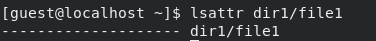{#fig:001 width=70%}

2. Изменяю права доступа у этого файла на `600` (рис. [-@fig:002]).

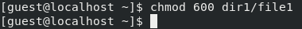{#fig:002 width=70%}

3. Теперь пробую от имени моего пользователя выдать расширенный атрибут `a` данному файлу, но получаю отказ (рис. [-@fig:003]).

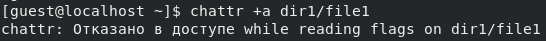{#fig:003 width=70%} 

4. Делаю то же самое, но от имени суперпользователя, и в этот раз всё получилось (рис. [-@fig:004]).

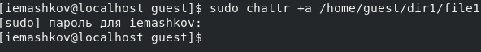{#fig:004 width=70%}

5. Теперь проверяю то, что атрибут был выдан, от имени guest (рис. [-@fig:005]).

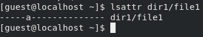{#fig:005 width=70%}

6. Пробую произвести дозапись и чтение данного файла и не получаю отказа (рис. [-@fig:006]).

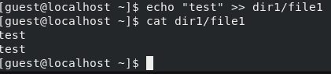{#fig:006 width=70%}

7. Но при удалении я получаю отказ (рис. [-@fig:007]).

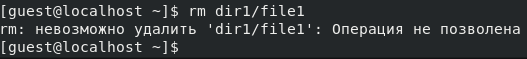{#fig:007 width=70%}

8. Отказ получаю и при переименовании файла (рис. [-@fig:008]).

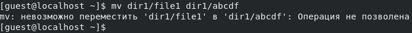{#fig:008 width=70%}

9. Такой же результат и при изменении прав у файла (рис. [-@fig:009]).

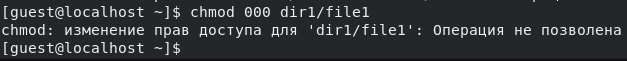{#fig:009 width=70%}

10. Теперь от имени суперпользователя снимаю этот атрибут (рис. [-@fig:010]).

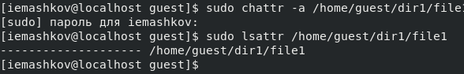{#fig:010 width=70%}

И снова делаю прогон всё тех же операций, но в этот раз отказа не получаю (кроме того, где я немного поторопился) (рис. [-@fig:011]).

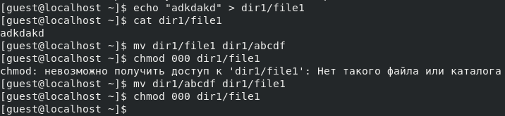{#fig:011 width=70%}

11. Теперь добавляю атрибут `i` на тот же файл от обычного пользователя, но, ожидаемо, получаю отказ (рис. [-@fig:012]).

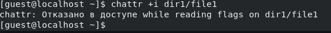{#fig:012 width=70%}

Т.к. от имени обычного пользователя ничего не вышло, я ставлю этот атрибут от имени суперпользователя (рис. [-@fig:013]).

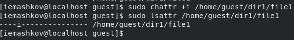{#fig:013 width=70%}

12. Делаю ещё один прогон таких операций как: дозапись, перезапись, чтение, переименование, удаление и изменение прав -- но ничего не выходит (рис. [-@fig:014]).

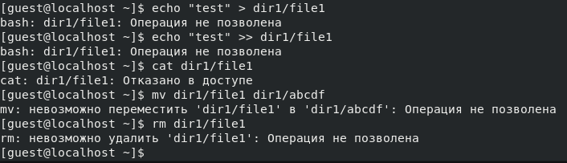{#fig:014 width=70%}

# Выводы

В результате выполнения работы я повысил свои навыки использования интерфейса командой строки (CLI), познакомился на примерах с тем, как используются основные и расширенные атрибуты при разграничении доступа. Имел возможность связать теорию дискреционного разделения доступа (дискреционная политика безопасности) с её реализацией на практике в ОС Linux. Опробовал действие на практике расширенных атрибутов «а» и «i»

# Список литературы{.unnumbered}

[Основы информационной безопасности](https://esystem.rudn.ru/pluginfile.php/2580594/mod_resource/content/4/003-lab_discret_2users.pdf)

[Права доступа](https://codechick.io/tutorials/unix-linux/unix-linux-permissions)

[Расширенные атрибуты](https://ru.manpages.org/xattr/7)

[Операции с расширенными атрибутами](https://p-n-z-8-8.livejournal.com/64493.html)
