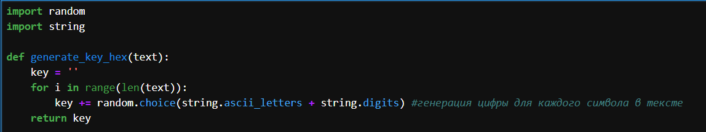
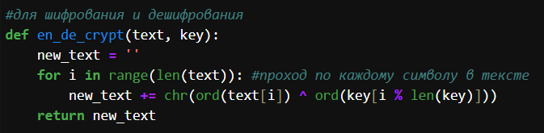
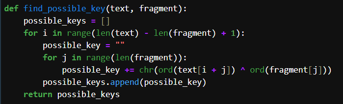
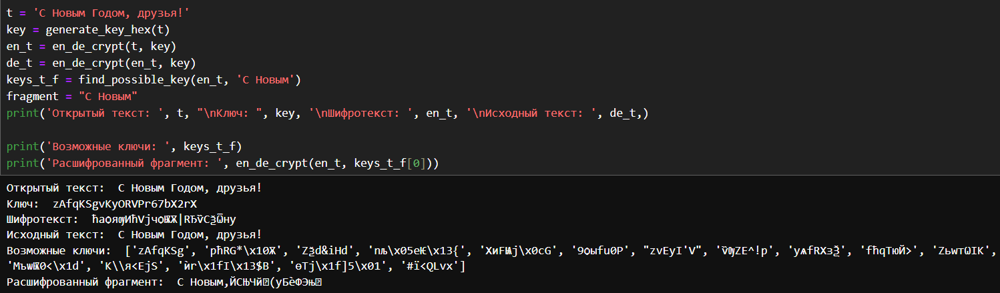

---
## Front matter
title: "Отчет по лабораторной работе №7"
subtitle: "Основы информационной безопасности"
author: "Машков Илья Евгеньевич"

## Generic otions
lang: ru-RU
toc-title: "Содержание"

## Bibliography
bibliography: bib/cite.bib
csl: pandoc/csl/gost-r-7-0-5-2008-numeric.csl

## Pdf output format
toc: true # Table of contents
toc-depth: 2
lof: true # List of figures
lot: true # List of tables
fontsize: 12pt
linestretch: 1.5
papersize: a4
documentclass: scrreprt
## I18n polyglossia
polyglossia-lang:
  name: russian
  options:
	- spelling=modern
	- babelshorthands=true
polyglossia-otherlangs:
  name: english
## I18n babel
babel-lang: russian
babel-otherlangs: english
## Fonts
mainfont: IBM Plex Serif
romanfont: IBM Plex Serif
sansfont: IBM Plex Sans
monofont: IBM Plex Mono
mathfont: STIX Two Math
mainfontoptions: Ligatures=Common,Ligatures=TeX,Scale=0.94
romanfontoptions: Ligatures=Common,Ligatures=TeX,Scale=0.94
sansfontoptions: Ligatures=Common,Ligatures=TeX,Scale=MatchLowercase,Scale=0.94
monofontoptions: Scale=MatchLowercase,Scale=0.94,FakeStretch=0.9
mathfontoptions:
## Biblatex
biblatex: true
biblio-style: "gost-numeric"
biblatexoptions:
  - parentracker=true
  - backend=biber
  - hyperref=auto
  - language=auto
  - autolang=other*
  - citestyle=gost-numeric
## Pandoc-crossref LaTeX customization
figureTitle: "Рис."
tableTitle: "Таблица"
listingTitle: "Листинг"
lofTitle: "Список иллюстраций"
lotTitle: "Список таблиц"
lolTitle: "Листинги"
## Misc options
indent: true
header-includes:
  - \usepackage{indentfirst}
  - \usepackage{float} # keep figures where there are in the text
  - \floatplacement{figure}{H} # keep figures where there are in the text
---

# Цель

Освоить на практике применение режима однократного гаммирования

# Задание

Нужно подобрать ключ, чтобы получить сообщение «С Новым Годом,
друзья!». Требуется разработать приложение, позволяющее шифровать и
дешифровать данные в режиме однократного гаммирования. Приложение
должно:
1. Определить вид шифротекста при известном ключе и известном открытом тексте.
2. Определить ключ, с помощью которого шифротекст может быть преобразован в некоторый фрагмент текста, представляющий собой один из возможных вариантов прочтения открытого текста

# Выполнение лабораторной работы

Я выполнала лабораторную работа на языке программирования Python, листинг программы и результаты выполнения приведены в отчете.

 Требуется разработать программу, позволяющее шифровать и дешифровать данные в режиме однократного гаммирования. Начнем с создания функции для генерации случайного ключа (рис. [-@fig:001]).

{#fig:001 width=70%}

Необходимо определить вид шифротекста при известном ключе и известном открытом тексте. Так как операция исключающего или отменяет сама себя, делаю одну функцю и для шифрования и для дешифрования текста (рис. [-@fig:002]).

{#fig:002 width=70%}

Нужно определить ключ, с помощью которого шифротекст может быть преобразован в некоторый фрагмент текста, представляющий собой один из возможных вариантов прочтения открытого текста. Для этого создаю функцию для нахождения возможных ключей для фрагмента текста (рис. [-@fig:003]). 

{#fig:003 width=70%}

Проверка работы всех функций. Шифрование и дешифрование происходит верно, как и нахождение ключей, с помощью которых можно расшифровать верно только кусок текста (рис. [-@fig:004]).

{#fig:004 width=70%}

Листинг программы 1:

```python

import random
import string

def generate_key_hex(text):
    key = ''
    for i in range(len(text)):
        key += random.choice(string.ascii_letters + string.digits) #генерация цифры для каждого символа в тексте
    return key

#для шифрования и дешифрования
def en_de_crypt(text, key):
    new_text = ''
    for i in range(len(text)): #проход по каждому символу в тексте
        new_text += chr(ord(text[i]) ^ ord(key[i % len(key)]))
    return new_text

def find_possible_key(text, fragment):
    possible_keys = []
    for i in range(len(text) - len(fragment) + 1):
        possible_key = ""
        for j in range(len(fragment)):
            possible_key += chr(ord(text[i + j]) ^ ord(fragment[j]))
        possible_keys.append(possible_key)
    return possible_keys

t = 'С Новым Годом, друзья!'
key = generate_key_hex(t)
en_t = en_de_crypt(t, key)
de_t = en_de_crypt(en_t, key)
keys_t_f = find_possible_key(en_t, 'С Новым')
fragment = "С Новым"
print('Открытый текст: ', t, "\nКлюч: ", key, '\nШифротекст: ', en_t, '\nИсходный текст: ', de_t,)

print('Возможные ключи: ', keys_t_f)
print('Расшифрованный фрагмент: ', en_de_crypt(en_t, keys_t_f[0]))
```

# Выводы

В ходе выполнения данной лабораторной работы мной было освоено на практике применение режима однократного гаммирования.

# Список литературы{.unnumbered}

